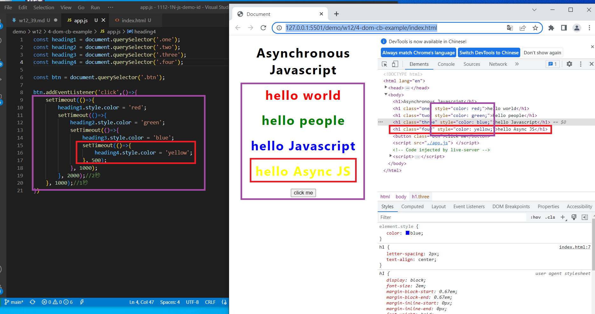
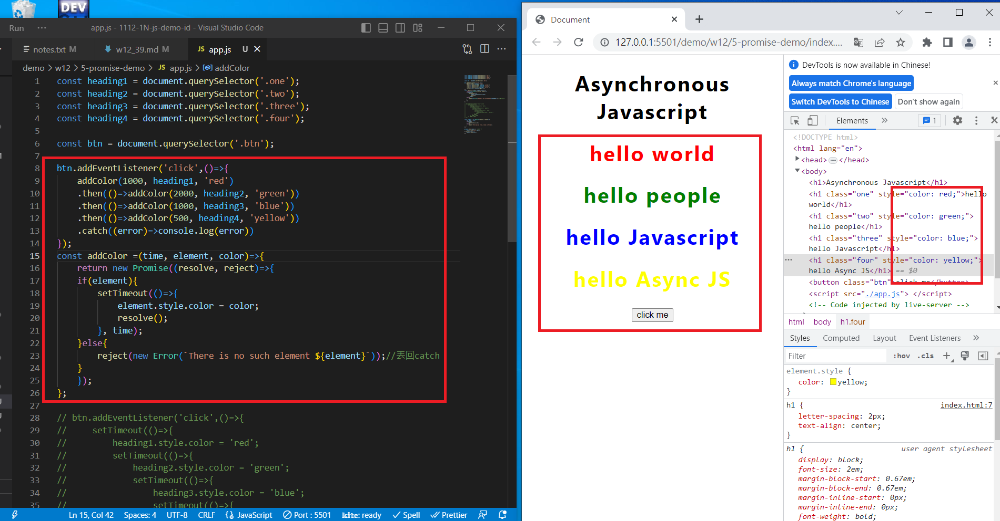
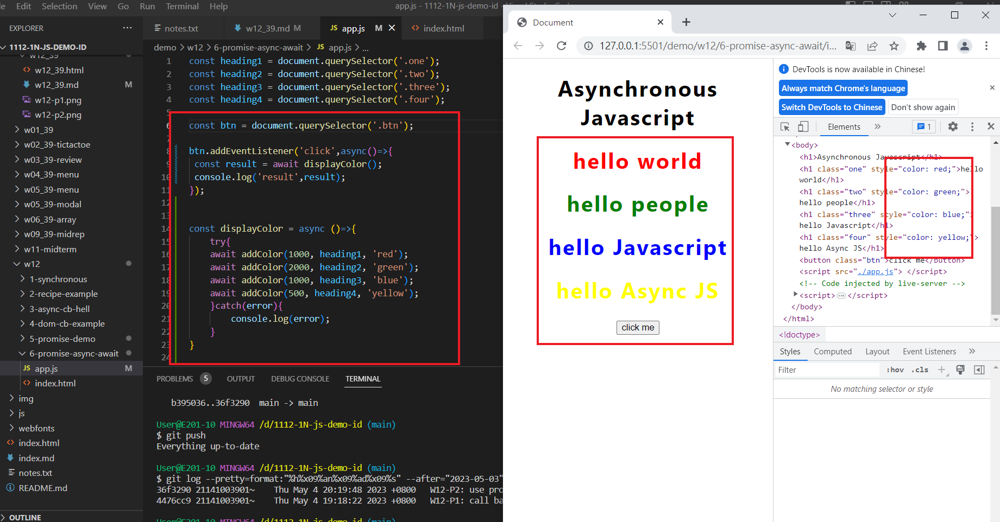
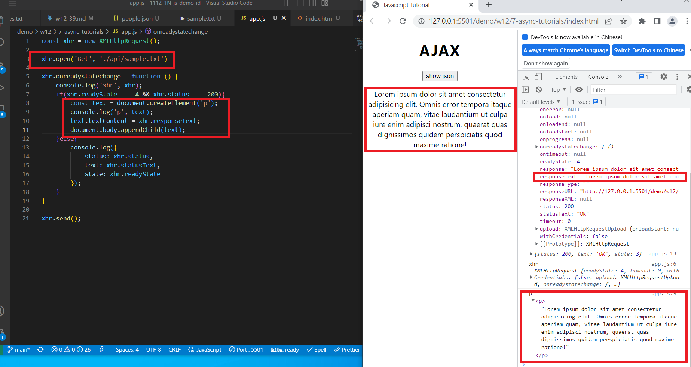
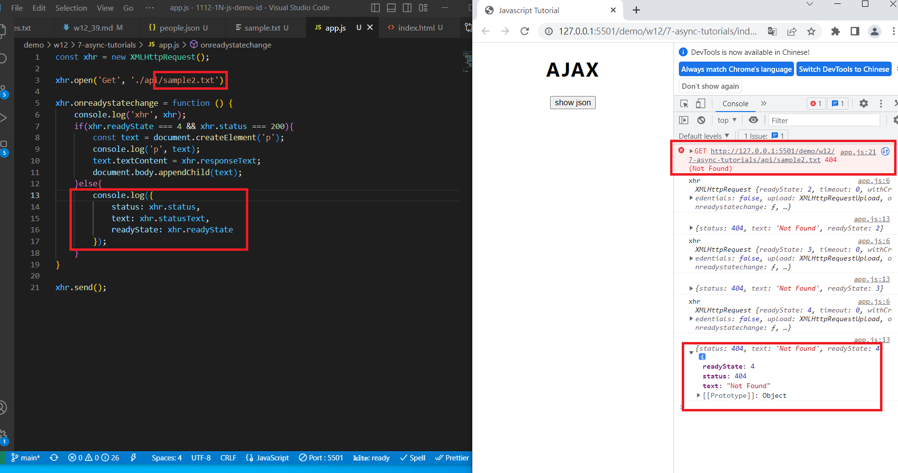
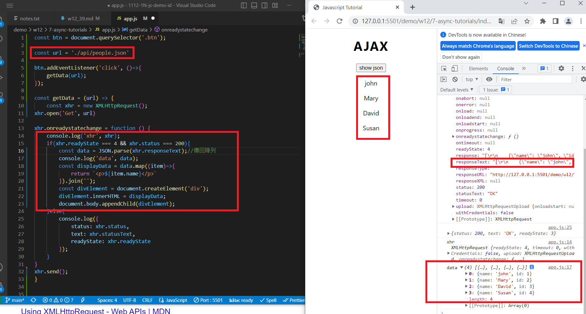

### W12-P1: call back hell DOM demo

### W12-P2: use promise to solve the cb hell problem

### W12-P3: use astnc/await to solve the cb hell problem

### W12-P4: xhr, get sample.txt

### success reading

### fail reading

### W12-P5: xhr, get people.json, and show names in browser

