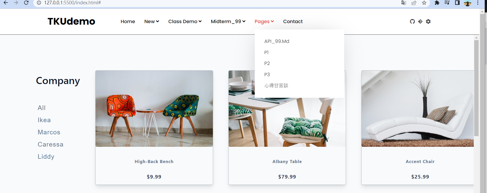
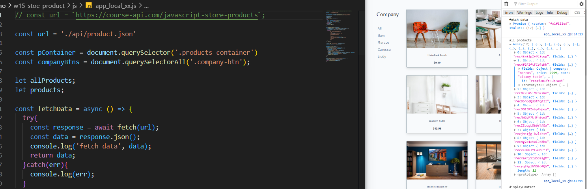
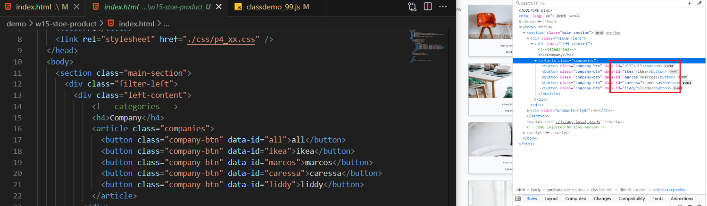
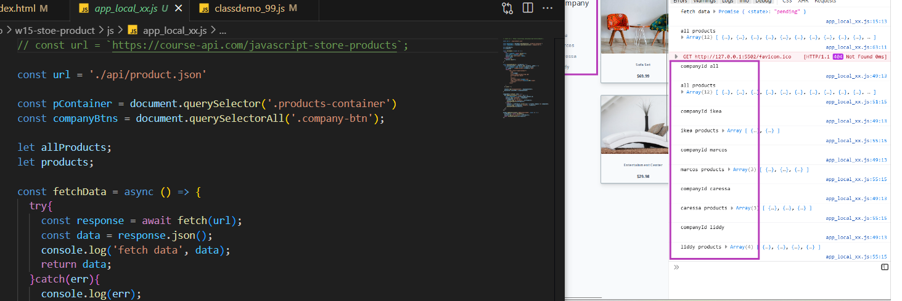

### W15-P1: prepare menu items for API project in Vercel

### W15-P2: get menu items from local json (products.json)

### W15-P3: get company products by pressing company buttons

### W15-P14: show w15 web page in Vercel

